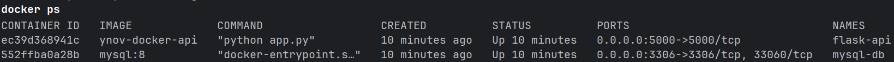
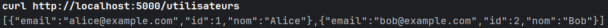
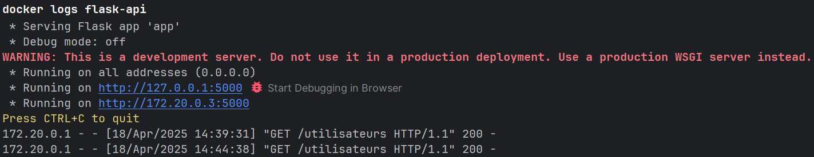

# Flask API with MySQL using Docker Compose

This project provides a simple setup for running a Flask REST API connected to a MySQL database using Docker Compose. It includes automated database initialization and environment variable management for secure configuration.

## Project Structure

```
ynov-docker/
├── api/
│   ├── app.py              # Flask application
│   ├── Dockerfile          # Docker image for Flask
│   ├── requirements.txt    # Python dependencies
├── db/
│   └── init.sql            # SQL initialization script
├── .env                    # Environment variables (not committed)
├── .env.example            # Sample .env file for reference
├── docker-compose.yml      # Docker Compose configuration
├── README.md               # Project documentation
└── captures/               # Screenshots (to be added manually)
```

## Environment Variables

`.env` file:

```
MYSQL_ROOT_PASSWORD=root
MYSQL_DATABASE=ynov
MYSQL_USER=admin
MYSQL_PASSWORD=admin123
```

## Setup Instructions

### Build and launch containers

```
docker-compose up -d
```

### Check running containers

```
docker ps
```

The services `flask-api` and `mysql-db` should be listed.

## API Testing

The API can be accessed via a browser or using `curl`:

```
curl http://localhost:5000/utilisateurs
```

Expected response format:

```json
[
  {
    "id": 1,
    "nom": "Alice",
    "email": "alice@example.com"
  },
  ...
]
```


## API Loging

The API can be logged using `docker logs`:

```
docker logs flask-api
```

Expected response format:



## Verification Checklist

- Flask API is accessible.
- MySQL is initialized with a predefined database and table.
- Containers communicate correctly.
- Docker Compose configuration functions as expected.

## Cleanup

To stop and remove containers and volumes:

```
docker-compose down -v
```

## Known Issues and Workarounds

- A delay in MySQL availability may prevent Flask from connecting immediately. This is handled using a retry mechanism to delay the Flask startup until MySQL is ready.
- Ensure service names used in the database connection match those defined in `docker-compose.yml`.

## Repository Content Requirements

The repository should include:

- `docker-compose.yml`
- API `Dockerfile`
- `init.sql` script
- Project `README.md`
- `screenshots/` folder
